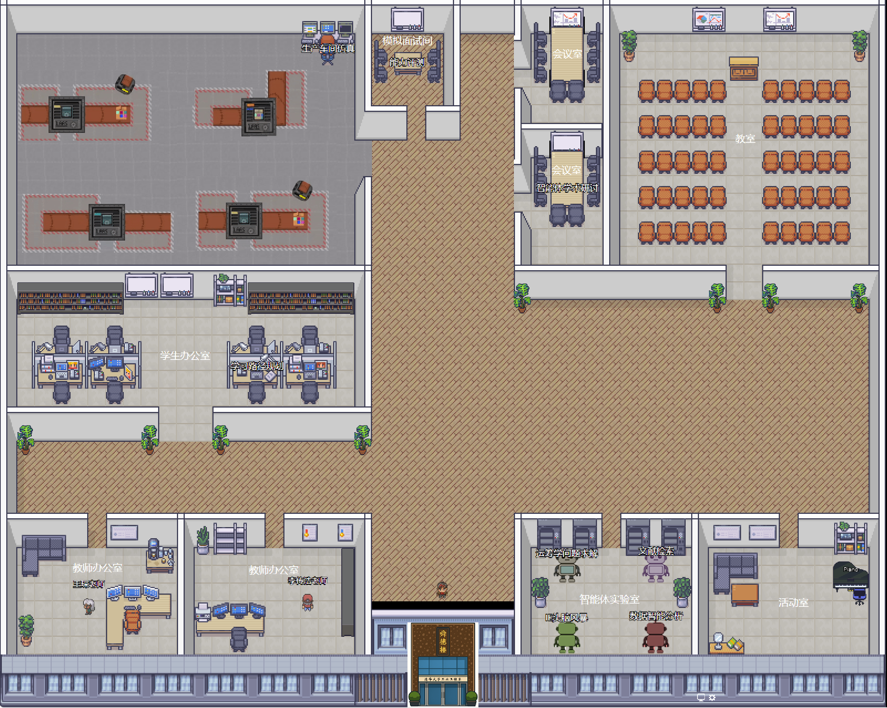

# ThisIsMyDepartment.AI

ThisIsMyDepartment.AI is a self-hostable virtual department environment for teams, labs, schools, and organizations that want identity-aware avatars, shared spaces, and AI-controlled characters in one deployable app.
It started from a customized Gather-style environment and is being refactored into a reusable open-source platform with a backend for identity, persistence, and LLM orchestration.



## What Works Today

The repository is no longer just a design draft. The current codebase already includes:

* backend-owned authentication handoff and session bootstrap
* stable app user IDs instead of transient guest names
* first-time avatar onboarding and persisted avatar updates
* persistent user profile storage in SQLite
* activity logging for player chat, agent chat, room joins, avatar updates, prompt updates, and iframe usage
* persisted conversation storage for player and AI-character chats
* backend-routed AI-character chat, without a separate Python sidecar for normal in-app use
* an integrated Socket.IO room server inside the backend package
* a fallback login page for local development and adapter testing
* browser runtime configuration for backend, realtime, and Jitsi endpoints

The project is still being cleaned up for a first open-source release, but it is already installable and usable for local development.

## Documentation Map

Start here depending on what you need:

* [doc/getting-started.md](doc/getting-started.md) for local install, startup, and day-to-day usage
* [doc/current-status.md](doc/current-status.md) for a snapshot of completed work, active limitations, and release-readiness notes
* [doc/auth-integration.md](doc/auth-integration.md) for integrating an upstream login system
* [doc/hosting.md](doc/hosting.md) for browser-hosted and reverse-proxy deployment guidance
* [.env.example](.env.example), [server/.env.local.example](server/.env.local.example), and [server/.env.production.example](server/.env.production.example) for copyable runtime configuration templates
* [doc/implementation-plan.md](doc/implementation-plan.md) for the repo-specific migration and cleanup plan
* [doc/thisismydepartment-overhaul-spec.md](doc/thisismydepartment-overhaul-spec.md) for the original target architecture and rationale

## Development

### Getting started

* Install [Node.js](https://nodejs.org/)
* Install [Visual Studio Code](https://code.visualstudio.com/)
* Use Node `16.20.2` for the legacy frontend toolchain. The repo is pinned to this version via Volta.
* Clone the source code:

  ```sh
  git clone <your-fork-or-release-url>
  ```

* Run `npm install` in the project folder to install root dependencies. This now also installs the backend package dependencies under `server/`.

For a clean local setup and first run, see [doc/getting-started.md](doc/getting-started.md).
If you need non-default runtime endpoints, copy [.env.example](.env.example) to `.env` before starting the frontend.

### Building the game

In Visual Studio Code press *Ctrl-Shift-B* to start the compiler in watch mode. This compiles the
TypeScript sources in the `src` folder to JavaScript in the `lib` folder. It also watches the `src`
folder for changes so changed files are compiled on-save.

Alternatively you can run `npm run compile` on the CLI to compile the project once or
`npm run watch` to continuously compile the project in watch mode.

### Running the app locally

For the current backend-driven flow, run both services:

```sh
npm run compile
npm run server:build
npm run server:start
npm start
```

The browser client defaults to `http://127.0.0.1:8000/` and the backend defaults to `http://127.0.0.1:8787/`.

Recommended local usage flow:

1. Start the backend.
2. Start the frontend.
3. Open `http://127.0.0.1:8000/`.
4. If you do not already have upstream auth configured, use the fallback login page.
5. On first login, choose an avatar.
6. Enter the room and interact with players, AI characters, and iframe content.

If `better-sqlite3` needs to rebuild on macOS for Node `16.20.2`, make sure `python` resolves in your shell. On machines that only expose `python3`, provide a temporary `python` shim before rerunning `npm install` or `npm run server:start`.

### Quick local smoke checks

Once both services are running, these URLs and behaviors should work:

* `http://127.0.0.1:8787/health` returns a JSON `ok` response
* `http://127.0.0.1:8000/` loads the browser client
* if unauthenticated, the frontend redirects to `http://127.0.0.1:8787/auth/login`
* after login, the app bootstraps a stable user identity and profile
* first-time users without a saved avatar are prompted to choose one before entering the room

### Running the game in a browser

There are four alternatives to run the game in the browser:

* In Visual Studio Code press *Ctrl-Shift-D* and launch the `webpack-dev-server` and
  one of the available browsers that can be selected by clicking on the drop down menu next to
  the "launch" button.
* Run `npm start` and point your browser to <http://localhost:8000/>. The browser automatically
  reloads the game when changes are detected (You still need to run the compiler in watch mode in VS
  Code or on the CLI to receive code changes).
* If you already have a local webserver you can simply open the `index.html` file in the project
  folder in your browser. This only works with a http(s) URL, not with a file URL.
* Run `npm run dist` to package the game into the `dist` folder. Open the `dist/index.html` in your
  browser to run the game. To publish the game simply copy the contents of the `dist` folder to a
  public web server.

### Running the backend

The repo now includes a lightweight backend service for:

* auth bootstrap and session handling
* profile and avatar storage
* persisted AI-character definitions
* activity logging
* conversation storage
* backend-routed agent chat
* integrated realtime room synchronization

* Install backend dependencies with `npm run server:install` if you need to provision them separately from the root install
* Build the backend with `npm run server:build`
* Start the backend with `npm run server:start`
* The default backend URL is <http://127.0.0.1:8787>
* The default persisted state database is `server/data/state.sqlite`
* Set `SERVER_STATE_DB_FILE` to use a different SQLite database path
* Legacy JSON state in `server/data/state.json` is migrated automatically on first startup if the SQLite database is empty

For local development, the backend includes a fallback `/auth/login` page and an insecure development handoff mode. For production hosting, the intended integration is an upstream website or gateway that authenticates the user first and then forwards normalized identity data to this backend.

Supported auth adapter paths now include:

* shared-secret POST handoff via `POST /auth/handoff`
* JWT handoff via `POST /auth/handoff` with a bearer token or `token` field
* reverse-proxy authenticated headers via `GET /auth/proxy-login`
* iframe or popup `postMessage` handoff via `GET /auth/postmessage-bridge`

Relevant backend environment variables:

* `TIMD_FRONTEND_BASE_URL`
* `TIMD_DEFAULT_ORGANIZATION`
* `TIMD_DEFAULT_DEPARTMENT`
* `TIMD_DEFAULT_ROOM_ID`
* `TIMD_DEFAULT_ROOM_DISPLAY_NAME`
* `AUTH_HANDOFF_SHARED_SECRET`
* `AUTH_JWT_SHARED_SECRET`
* `AUTH_JWT_ISSUER`
* `AUTH_JWT_AUDIENCE`
* `AUTH_PROXY_PROVIDER`
* `AUTH_PROXY_EXTERNAL_ID_HEADER`
* `AUTH_PROXY_DISPLAY_NAME_HEADER`
* `AUTH_PROXY_EMAIL_HEADER`
* `AUTH_PROXY_ORGANIZATION_HEADER`
* `AUTH_PROXY_DEPARTMENT_HEADER`
* `AUTH_PROXY_ROLES_HEADER`
* `AUTH_PROXY_AUTHENTICATED_HEADER`
* `AUTH_PROXY_AUTHENTICATED_VALUE`
* `AUTH_POSTMESSAGE_ALLOWED_ORIGINS`

Copyable examples live in [server/.env.local.example](server/.env.local.example) and [server/.env.production.example](server/.env.production.example). The backend itself does not auto-load a `.env` file, so pass those values through your shell or process manager.

Relevant frontend realtime environment variables for browser builds:

* `TIMD_BACKEND_BASE_URL`
* `TIMD_SOCKET_BASE_URL`
* `TIMD_JITSI_DOMAIN`
* `TIMD_JITSI_MUC`
* `TIMD_JITSI_SERVICE_URL`
* `TIMD_JITSI_CLIENT_NODE`

Jitsi note:

* on localhost, voice and video stay disabled unless `TIMD_JITSI_*` variables are configured explicitly
* this avoids repeated browser errors from an assumed local `/http-bind` endpoint when no Jitsi server is running
* on non-localhost deployments, the frontend still falls back to same-host Jitsi paths if explicit values are not provided

Realtime note:

* the authoritative Socket.IO room server is now integrated into the backend under `server/` and runs in the same Node process as the HTTP API
* in local development, the frontend defaults to the backend port `8787` for realtime unless `TIMD_SOCKET_BASE_URL` is set explicitly
* upgrading `socket.io-client` still requires coordinated client and server testing because the browser protocol remains legacy Socket.IO v2-style

See [doc/auth-integration.md](doc/auth-integration.md) and [doc/hosting.md](doc/hosting.md) for production-oriented setup.

### Realtime smoke test

The repo includes a repeatable Socket.IO smoke test for multiplayer contract validation. It checks:

* room membership sync
* bidirectional `characterUpdate` delivery
* `directMessage` relay
* player conversation open and close relay
* disconnect broadcast with stable user ID
* reconnect broadcast with stable user ID
* post-reconnect `characterUpdate` delivery

Run it against a freshly started backend instance built from the current code:

```sh
npm run server:build
PORT=8789 node server/dist/server/src/app.js
```

Then in another shell run:

```sh
TIMD_REALTIME_URL=http://127.0.0.1:8789 npm run smoke:realtime
```

If `8787` is already occupied by an older server process, use a fresh port for the smoke test so you validate the current build rather than stale code.

Open-source release follow-up tasks are tracked in [doc/open-source-release-checklist.md](doc/open-source-release-checklist.md).

### Modifying the Scene

Install [Tiled](http://www.mapeditor.org/) and then use it to open `assets/map/map.tiledmap.json`. Modify the scene and then save it. The changes will be reflected after re-compiliation.

### LLM controlled characters

Definitions of AI-controlled characters live under `src/main/agents`. See `chuanhao.agent.ts` for example:

```ts
import type { LLMAgentDefinition } from "./AgentDefinition";

const chuanhaoAgent: LLMAgentDefinition = {
    id: "ChuanhaoBot",
    agentId: "chuanhao-bot",
  displayName: "运筹学课程老师",
    spriteIndex: 4,
    position: { x: 400, y: 200 },
    caption: "按E键聊天",
    systemPrompt: "You are DemoBot, a cheerful virtual guide for a research factory simulation.",
    walkArea: { x: 400, y: 200, width: 100, height: 100 }
};

export default chuanhaoAgent;
```

The active architecture is backend-routed:

* the browser client talks to this repo's backend
* the backend decides how to call the LLM provider
* provider credentials stay on the server side
* running a separate local Python bridge is no longer the default path for normal in-app agent chat

Teacher AI characters and student AI characters should use the same implementation, functionality, and UI. In the current shipped setup, teacher characters are simply pre-placed in the environment by default.

The current user can edit the system prompt for their own offline AI-controlled character from the in-game settings menu.

At the moment, the backend has a mock provider path and an OpenAI path controlled by `OPENAI_API_KEY`.

## Current Limitations

These areas are still in progress:

* open-source release cleanup and final branding polish
* broader provider support beyond the current mock and OpenAI paths
* deeper modernization of the legacy frontend and Socket.IO stack
* final public repository metadata, maintainer details, and release packaging polish
* broader testing and packaging polish for Electron distribution
